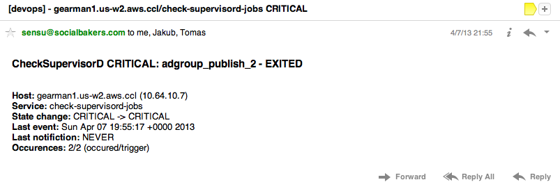
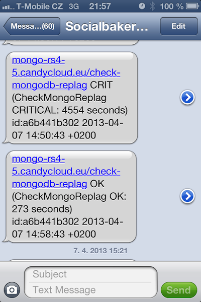

Notifu
======
Sensu notification REST API handler. This documentation is work-in-progress

Features
--------
  - accepts JSON event objects directly from sensu
  - configurable notification groups with any number of SLA sub-groups including renotification interval per each and timeperiods per day of week
  - two types of notifications
    - duty notifications
      - high-priority notifications (state changes `CRITICAL -> OK`, `* -> CRITICAL` )
      - mapped to SMS sending command (configurable shell command)
    - report notifications
      - all priority notifications
      - mapped to mail feature
      - disregards duty timeperiods
      - (mail is sent via authenticated gmail SMTP for now...)
  - any check can notify multiple groups
  - any group members (both reporting and duty notifications) can be set via REST API
  - self-healing service: if Redis, gets somehow empty, no need for restarts
  - a lot of information can be queried via API

Screenshots
-----------
*"cuz seeing is believing"*

E-mail report



Duty SMS notification



Prerequisities
---------------
  - running Sensu architecture
  - Redis (>= 2.x) (you can use the same as for sensu)
  - Ruby (>= 1.8.7)
  - Ruby Bundler
  - custom variable for each check with `"sla": ["<group_name>:<sla_level>", ...]` (groups and SLA levels are covered in Installation)

Installation
------------
  - clone this repo and chdir into it
  - create `config/notifu.yam` from example
  - create at least one group (`config/groups/group_name.yaml`)
  - run `bundle install`
  - run `bundle exec ruby run.rb &`
  - put following configuration in Sensu's config.json:

```
"handlers": {
  "notifu": {
    "type": "pipe",
    "command": "/usr/bin/curl -X POST -d @- -H 'Content-type: application/json' http://notifu-host:8000/api/notification",
    "severities": [
      "ok",
      "warning",
      "critical"
    ]
  }
}
```
